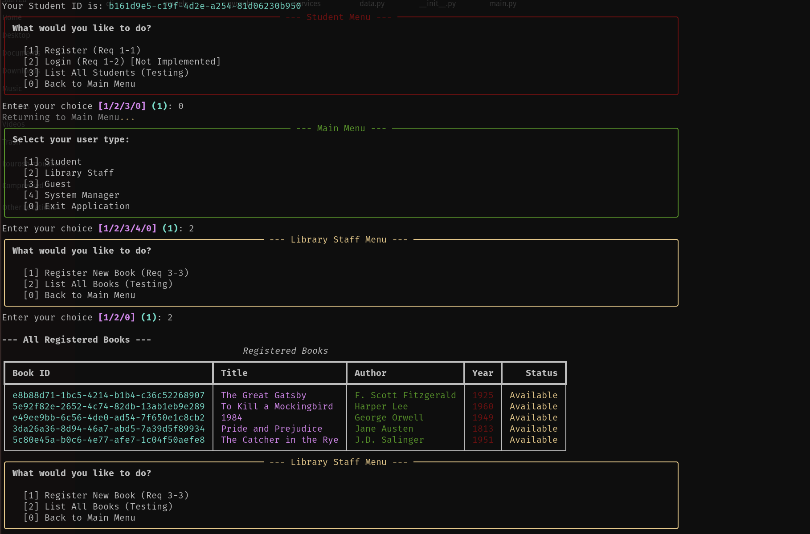

# University Library Management System

A simple, in-memory University Library Management System implemented in Python. Designed as a CLI application with a focus on clear data models and a minimal service layer. This repository is a teaching/example project used for a software engineering assignment.

## Highlights

- Small CLI-driven library app for managing students and books
- In-memory data store (no external DB required)
- Clear separation of models, services, and CLI UI
- Uses `rich` for nicer CLI output

## Project structure

```
├── src/
│   ├── __init__.py
│   ├── cli/
│   │   ├── __init__.py
│   │   ├── main_menu.py
│   │   ├── staff_menu.py
│   │   ├── student_menu.py
│   │   └── ui.py           <-- NEW
│   ├── data.py
│   ├── models/
│   │   ├── __init__.py
│   │   ├── book.py
│   │   └── student.py
│   ├── services/
│   │   ├── __init__.py
│   │   ├── book_service.py
│   │   └── student_service.py
│   └── main.py
└── architect.md
```

See `architect.md` for additional architecture and data model notes.

## Data models

- Student: `student_id` (UUID), `username`, `password_hash`, `is_active`
- Book: `book_id` (UUID), `title`, `author`, `publication_year`, `is_available`

## Requirements

- Python 3.10+ (recommended)
- `rich` (for CLI formatting)

You can install `rich` directly:

```bash
python -m pip install rich
```

If you prefer a virtual environment:

```bash
python -m venv .venv
source .venv/bin/activate
python -m pip install --upgrade pip
python -m pip install rich
```

## How to run

From the repository root, run:

```bash
python src/main.py
```

(or run the module if set up accordingly)

The CLI menus are located under `src/cli/` and the main entrypoint is `src/main.py`.

## Tests

No test harness is included by default. If you add tests, place them in a `tests/` directory and run with `pytest`.

## Extending the project

Recommended small improvements:

- Persist data to a JSON file or SQLite
- Add unit tests for services and models
- Add user authentication and password hashing improvements
- Add CLI commands to export/import catalog

## Images




## License & credits

This project was created for a software engineering assignment. Choose a license for your repository (e.g., MIT) and add a `LICENSE` file if you intend to publish it publicly.

## Where to find design notes

See `architect.md` in the repository root for architecture, models, and service descriptions.

---

If you'd like, I can:

- Add a `requirements.txt` or `pyproject.toml` listing `rich` and Python version
- Add a minimal `LICENSE` file (MIT)
- Add a simple `run.sh` script to create a venv and run the app

Tell me which of those you'd like next and I'll implement it.
